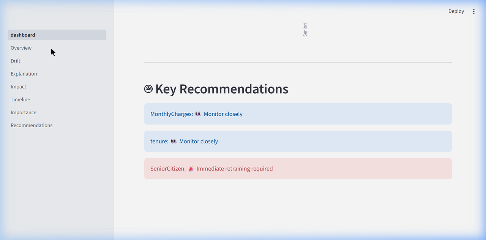
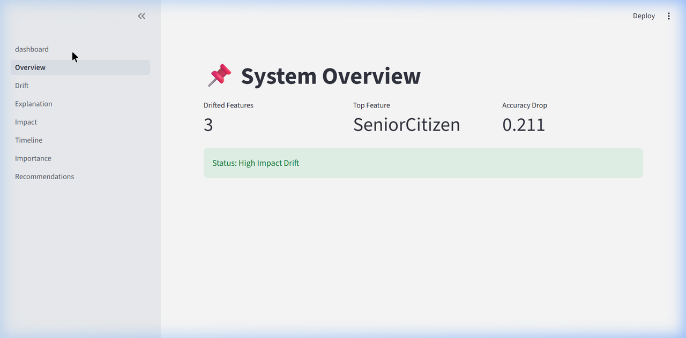
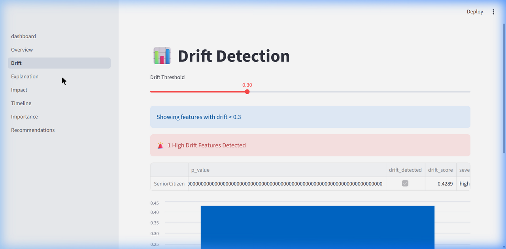
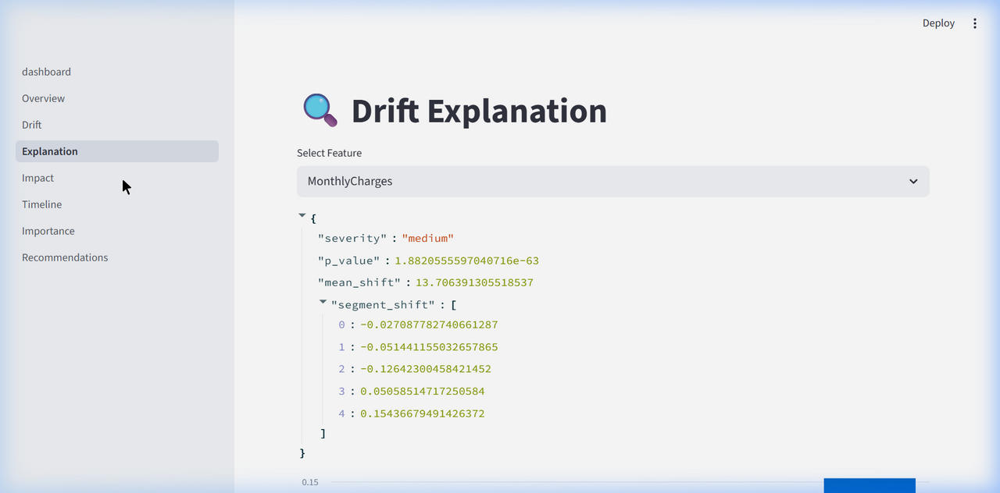
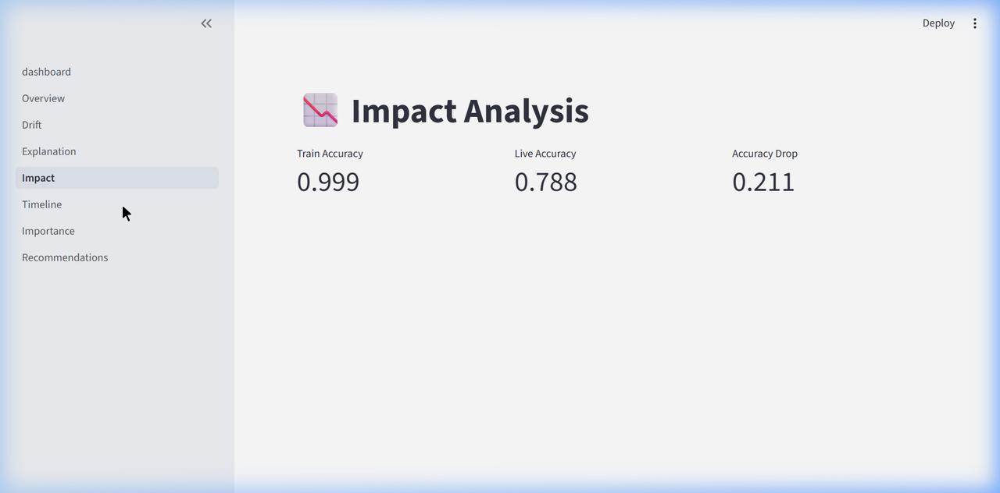
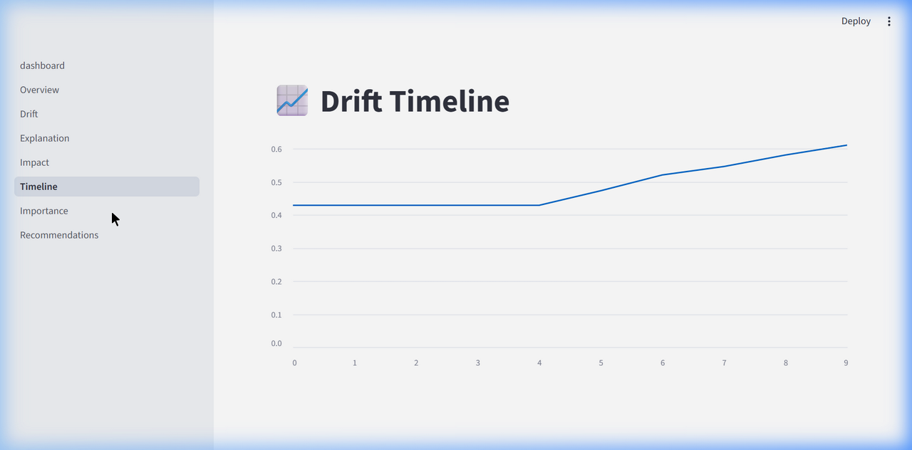
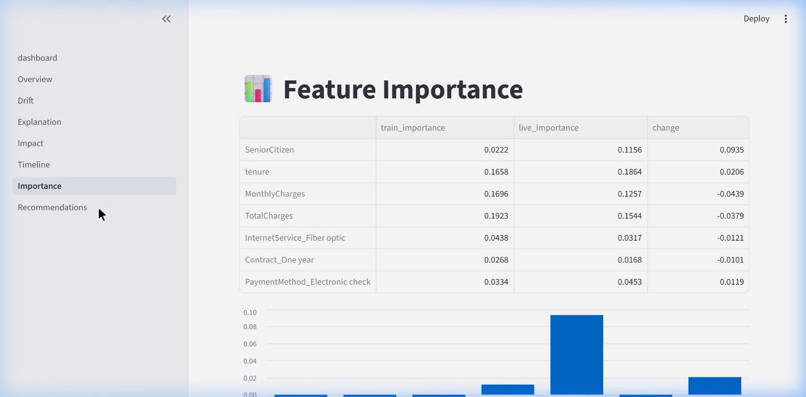
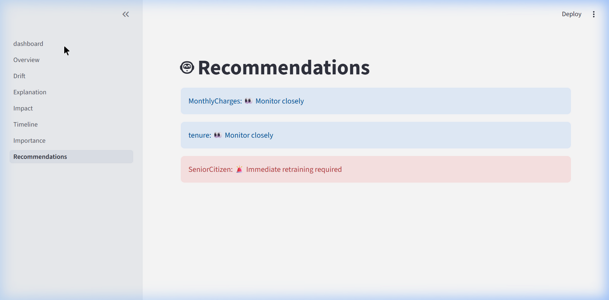
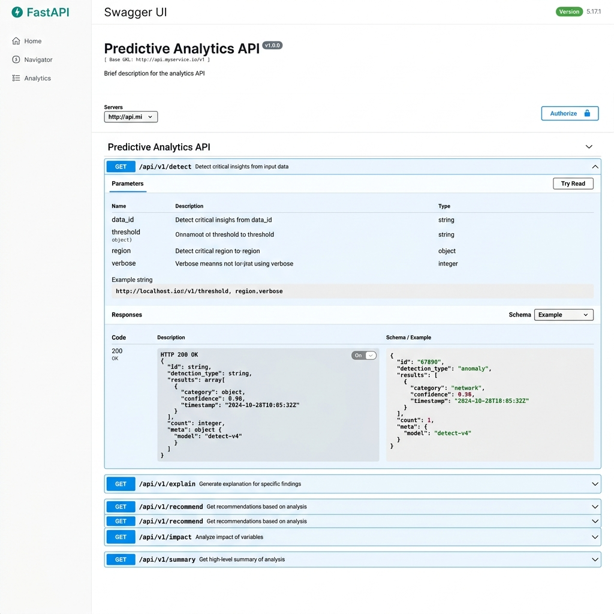

# 🧠 Model Drift Detective

[](https://github.com/Mazhar26/model-drift-detective/actions/workflows/ci.yml)

[](https://opensource.org/licenses/MIT)


An AI-powered model monitoring platform that detects, explains, and recommends actions for data drift in machine learning models. Built with FastAPI, Streamlit, Docker, Kubernetes, and Terraform using Infrastructure-as-Code deployment practices.

## Highlights

- Cloud-native deployment using Kubernetes and Terraform
- Automated CI/CD pipelines with GitHub Actions
- Dockerized FastAPI backend and Streamlit dashboard
-  Automated container publishing to Docker Hub with GitHub Actions
- Infrastructure-as-Code with modular Terraform design
- Drift detection using KS-Test and Random Forest analysis
- Configurable deployments through Kubernetes ConfigMaps

---

## 🧩 System Architecture

```
┌──────────────────────────────────────────────────────────────────────┐
│                        DOCKER COMPOSE                                │
│                                                                      │
│  ┌─────────────────────┐         ┌──────────────────────────────┐   │
│  │   Streamlit (8501)  │  HTTP   │      FastAPI (8000)          │   │
│  │                     │────────▶│                              │   │
│  │  ┌───────────────┐  │ /api/v1 │  ┌────────────────────────┐ │   │
│  │  │ dashboard.py  │  │         │  │     API Router v1      │ │   │
│  │  ├───────────────┤  │         │  │                        │ │   │
│  │  │ 1_Overview    │  │         │  │  /detect    /explain   │ │   │
│  │  │ 2_Drift       │  │         │  │  /impact    /recommend │ │   │
│  │  │ 3_Explanation │  │         │  │  /importance /timeline │ │   │
│  │  │ 4_Impact      │  │         │  │  /summary             │ │   │
│  │  │ 5_Timeline    │  │         │  └──────────┬─────────────┘ │   │
│  │  │ 6_Importance  │  │         │             │               │   │
│  │  │ 7_Recommend   │  │         │             ▼               │   │
│  │  └───────────────┘  │         │  ┌────────────────────────┐ │   │
│  │                     │         │  │    ML Engine (src/)    │ │   │
│  │  utils.py ──────────┼────┐    │  │                        │ │   │
│  │  config.py          │    │    │  │  drift.py     (KS Test)│ │   │
│  │  logger.py          │    │    │  │  explain.py   (Shifts) │ │   │
│  └─────────────────────┘    │    │  │  impact.py    (RF Acc) │ │   │
│                             │    │  │  importance.py(RF Imp) │ │   │
│                             │    │  │  recommend.py (Rules)  │ │   │
│                             │    │  │  timeline.py  (Sim)    │ │   │
│                             │    │  │  data_setup.py(Load)   │ │   │
│                             │    │  └──────────┬─────────────┘ │   │
│                             │    │             │               │   │
│                             │    │             ▼               │   │
│                             │    │  ┌────────────────────────┐ │   │
│                             └───▶│  │  Telco Churn Dataset   │ │   │
│                                  │  │  (data/*.csv)          │ │   │
│                                  │  └────────────────────────┘ │   │
│                                  └──────────────────────────────┘   │
│                                                                      │
│  Shared: config.py │ logger.py │ .env                                │
└──────────────────────────────────────────────────────────────────────┘
         │                                        │
         ▼                                        ▼
  ┌─────────────┐                        ┌─────────────────┐
  │ GitHub CI   │                        │  logs/app.log   │
  │ (pytest +   │                        │  (structured    │
  │  smoke +    │                        │   logging)      │
  │  flake8)    │                        └─────────────────┘
  └─────────────┘
```

**Data Flow:**
```
User ──▶ Streamlit Dashboard ──▶ HTTP /api/v1/* ──▶ FastAPI Backend
                                                         │
                          ┌──────────────────────────────┘
                          ▼
              ┌─── drift.py ────── KS Test ──────────┐
              ├─── explain.py ──── Mean Shift ────────┤
              ├─── impact.py ───── RF Accuracy ───────┤──▶ JSON Response
              ├─── importance.py ─ RF Importance ─────┤
              ├─── recommend.py ── Smart Rules ───────┤
              └─── timeline.py ─── Drift Sim ─────────┘
                          │
                          ▼
              Telco Customer Churn Dataset (7,043 rows)
```

---

## 🌐 Live Demo

*   **FastAPI Backend API**: [https://drift-api-5fy5.onrender.com](https://drift-api-5fy5.onrender.com)
*   **FastAPI Interactive Swagger UI Docs**: [https://drift-api-5fy5.onrender.com/docs](https://drift-api-5fy5.onrender.com/docs)
*   **Streamlit Web Dashboard**: *(Add your Streamlit Dashboard Live URL here once deployed)*

---


## 📸 Screenshots

### Main Dashboard
> Lightweight overview with key metrics, drift chart, and top recommendations at a glance.



### System Overview
> Quick health check — drifted feature count, top drifted feature, accuracy drop, and system status.



### Drift Detection
> Interactive threshold slider to explore which features have drifted, with severity labels and bar chart.



### Drift Explanation
> Feature-level deep dive — severity, p-value, mean shift, and segment distribution changes.



### Impact Analysis
> Model performance comparison between training and live data with accuracy drop metric.



### Drift Timeline
> Simulated drift over 10 steps showing how drift scores increase over time.



### Feature Importance
> Comparison of feature importance between train and live models, highlighting the biggest changes.



### Recommendations
> Smart, severity-based action items — from "Monitor closely" to "Immediate retraining required."



### FastAPI Swagger UI
> Auto-generated interactive API documentation with all endpoints, request/response schemas, and try-it-out functionality.



---

## 📁 Project Structure

```
model-drift-mvp/
├── api/
│   └── main.py              # FastAPI backend (10 endpoints)
├── src/
│   ├── data_setup.py         # Data loading + drift simulation
│   ├── drift.py              # KS-test based drift detection
│   ├── explain.py            # Drift explanation with segment analysis
│   ├── impact.py             # Model accuracy impact analysis
│   ├── importance.py         # Feature importance comparison
│   ├── recommend.py          # Smart action recommendations
│   ├── timeline.py           # Drift simulation over time
│   ├── history.py            # SQLite drift history persistence
│   └── alerts.py             # Email alert system
├── tests/                    # pytest unit tests (28 tests)
│   ├── test_drift.py
│   ├── test_recommend.py
│   ├── test_impact.py
│   ├── test_config.py
│   ├── test_alerts.py
│   └── test_history.py
├── pages/                    # Streamlit sidebar pages
│   ├── 1_Overview.py
│   ├── 2_Drift.py
│   ├── 3_Explanation.py
│   ├── 4_Impact.py
│   ├── 5_Timeline.py
│   ├── 6_Importance.py
│   └── 7_Recommendations.py
├── data/
│   └── WA_Fn-UseC_-Telco-Customer-Churn.csv
├── .github/workflows/
│   └── ci.yml                # GitHub Actions CI pipeline
├── k8s/                      # Kubernetes manifests
│   ├── api-deployment.yaml
│   ├── dashboard-deployment.yaml
│   ├── api-service.yaml
│   ├── dashboard-service.yaml
│   └── configmap.yaml
├── terraform/                # Infrastructure as Code
│   ├── namespace.tf
│   ├── configmap.tf
│   ├── services.tf
│   ├── deployments.tf
│   ├── variables.tf
│   ├── terraform.tfvars
│   ├── outputs.tf
│   ├── providers.tf
│   └── .terraform.lock.hcl
├── dashboard.py              # Streamlit main dashboard
├── utils.py                  # Shared utilities (API client)
├── config.py                 # Centralized configuration
├── logger.py                 # Structured logging setup
├── smoke_test.py             # Automated smoke test (18 checks)
├── Dockerfile                # FastAPI container
├── Dockerfile.streamlit      # Streamlit container
├── docker-compose.yml        # Multi-service orchestration
├── .pre-commit-config.yaml   # Code quality hooks
├── CHANGELOG.md              # Release history
├── LICENSE                   # MIT License
└── requirements.txt
```

---

## 🚀 Quick Start with Docker

The fastest way to get running — no manual setup needed:

```bash
docker-compose up --build
```

Then open **http://localhost:8501** for the dashboard, and **http://localhost:8000/docs** for the Swagger UI.

To stop:

```bash
docker-compose down
```

---

## ☸️ Kubernetes & Terraform Deployment

The platform can also be deployed to Kubernetes using Terraform-managed infrastructure.

### Infrastructure Provisioned

Terraform manages:

* Kubernetes Namespace
* ConfigMap-based application configuration
* FastAPI Deployment
* Streamlit Dashboard Deployment
* ClusterIP Service for API communication
* NodePort Service for dashboard access

### Deployment Architecture

```
Terraform
    │
    ▼
Kubernetes Provider
    │
    ▼
Minikube Cluster
    │
    ├── drift-api Deployment
    │      └── ClusterIP Service (8000)
    │
    └── drift-dashboard Deployment
           └── NodePort Service (8501)
```

### Initialize Terraform

```bash
cd terraform
terraform init
```

### Review Infrastructure Changes

```bash
terraform plan
```

### Apply Infrastructure

```bash
terraform apply
```

### Verify Deployment

```bash
kubectl get all -n model-drift
```

Expected:

```
drift-api         1/1 Running
drift-dashboard   1/1 Running
```

### Container Images

Build application images:

```bash
docker build -t drift-api:latest .
docker build -f Dockerfile.streamlit -t drift-dashboard:latest .
```

Load images into Minikube:

```bash
minikube image load drift-api:latest
minikube image load drift-dashboard:latest
```

### Docker Hub Images

Images are automatically built and published through GitHub Actions CI/CD.

**API Image**

```
zami0/model-drift-api
```

**Dashboard Image**

```
zami0/model-drift-dashboard
```

Every successful CI run publishes:

```
latest
<commit-sha>
```

tags for traceable deployments.

---

## 🚀 Getting Started (Manual)

### 1. Clone & Install

```bash
git clone https://github.com/Mazhar26/model-drift-detective.git
cd model-drift-detective
pip install -r requirements.txt
cp .env.example .env
```

### 2. Start the API Server

```bash
python -m uvicorn api.main:app --port 8000
```

### 3. Start the Dashboard

```bash
streamlit run dashboard.py
```

### 4. Open in Browser

Navigate to **http://localhost:8501**

---

## 🔌 API Endpoints

| Endpoint | Method | Description |
|---|---|---|
| `/` | GET | Health check |
| `/api/v1/detect?threshold=0.3` | GET | Detect drift above threshold |
| `/api/v1/explain` | GET | Explain drifted features |
| `/api/v1/impact` | GET | Model accuracy impact analysis |
| `/api/v1/recommend` | GET | Smart action recommendations |
| `/api/v1/importance` | GET | Feature importance comparison |
| `/api/v1/timeline` | GET | Drift simulation over time |
| `/api/v1/summary` | GET | Overall system summary |
| `/api/v1/history` | GET | Retrieve drift check history (SQLite) |
| `/api/v1/history/trend` | GET | Daily aggregated drift trends |

---

## 🔍 How It Works

1. **Data Loading** — Telco Churn dataset is split into train/live. The live set gets simulated drift (scale, shift, and noise) on key features.

2. **Drift Detection** — Uses the **Kolmogorov-Smirnov test** (`scipy.stats.ks_2samp`) to compare distributions between train and live data. Features are scored and classified by severity (high/medium/low).

3. **Explanation** — Computes mean shifts and segment-level distribution changes for each drifted feature.

4. **Impact Analysis** — Trains a **Random Forest** on the training data and evaluates it on both datasets to quantify the accuracy drop caused by drift.

5. **Feature Importance** — Compares feature importance rankings between models trained on train vs live data to identify which features changed the most.

6. **Recommendations** — Combines drift severity and accuracy impact to generate prioritized action items (immediate retrain, monitor, etc.).

---

## 🏗 Infrastructure Features

* Terraform-managed Kubernetes infrastructure
* Modular Infrastructure-as-Code design
* Namespace isolation for workloads
* ConfigMap-based runtime configuration
* Kubernetes Deployments and Services
* Dockerized FastAPI and Streamlit workloads
* Automated Docker image publishing to Docker Hub
* GitHub Actions CI/CD pipeline
* Local Kubernetes development using Minikube
* Infrastructure validation through Terraform
* Container build verification through CI

---

## 🔄 CI/CD Pipeline

GitHub Actions automatically validates application and infrastructure changes on every push and pull request.

### Pipeline Stages

1. Test Suite
   - Pytest unit tests
   - Smoke tests
   - FastAPI startup verification

2. Code Quality
   - Black formatting checks
   - isort import validation
   - flake8 linting

3. Infrastructure Validation
   - terraform fmt -check
   - terraform init
   - terraform validate

4. Container Validation
   - Build FastAPI Docker image
   - Build Streamlit Docker image

5. Artifact Publishing
   - Publish API image to Docker Hub
   - Publish Dashboard image to Docker Hub
   - Tag images with latest and commit SHA

### Deployment Flow

```
Git Push
   ↓
GitHub Actions
   ↓
Tests + Linting
   ↓
Terraform Validation
   ↓
Docker Build
   ↓
Docker Hub Push
```
---

## 🧪 Testing

Run the smoke test to verify all modules:

```bash
python smoke_test.py
```

Expected output:
```
📦 Data Loading
  ✅ Train set loaded
  ✅ Live set loaded
  ✅ Churn column exists
  ✅ No NaN in train
  ✅ Churn is integer

🔍 Drift Detection
  ✅ Drift results returned
  ✅ Results have expected keys

📝 Drift Explanation
  ✅ Explanation returned
  ✅ Contains mean values

📉 Impact Analysis
  ✅ Impact returned
  ✅ Has accuracy fields
  ✅ Train accuracy > 0
  ✅ Accuracy drop is number

📊 Feature Importance
  ✅ Importance returned
  ✅ Has change field

📈 Timeline Simulation
  ✅ Timeline returned
  ✅ Steps have expected fields
  ✅ Drift increases over time

========================================
Results: 18 passed, 0 failed
========================================
```

Run the full unit test suite with pytest:

```bash
python -m pytest tests/ -v
```

Expected output:
```
collected 28 items

tests/test_alerts.py    ....    [ 14%]
tests/test_config.py    ...     [ 25%]
tests/test_drift.py     ........[ 53%]
tests/test_history.py   .....   [ 71%]
tests/test_impact.py    ....    [ 85%]
tests/test_recommend.py ....    [100%]

28 passed in ~8s
```

---

## 🛠️ Tech Stack

- **Backend:** FastAPI, Uvicorn
- **Frontend:** Streamlit
- **ML:** scikit-learn (Random Forest), SciPy (KS-test)
- **Data:** Pandas, NumPy
- **Containerization:** Docker, Docker Compose
- **Orchestration:** Kubernetes (Minikube)
- **Infrastructure as Code:** Terraform
- **CI/CD:** GitHub Actions
- **Container Registry:** Docker Hub
- **Code Quality:** Black, Flake8, isort, pre-commit
- **Dataset:** [Telco Customer Churn](https://www.kaggle.com/datasets/blastchar/telco-customer-churn)

---

## 🧑‍💻 Development Setup

### Install Dependencies

```bash
pip install -r requirements.txt
```

### Set Up Pre-commit Hooks

```bash
pip install pre-commit
pre-commit install
```

This will automatically run **Black** (formatter), **Flake8** (linter), and **isort** (import sorter) on every commit.

### Run Hooks Manually

```bash
pre-commit run --all-files
```

---

## 📄 License

This project is licensed under the [MIT License](LICENSE).
